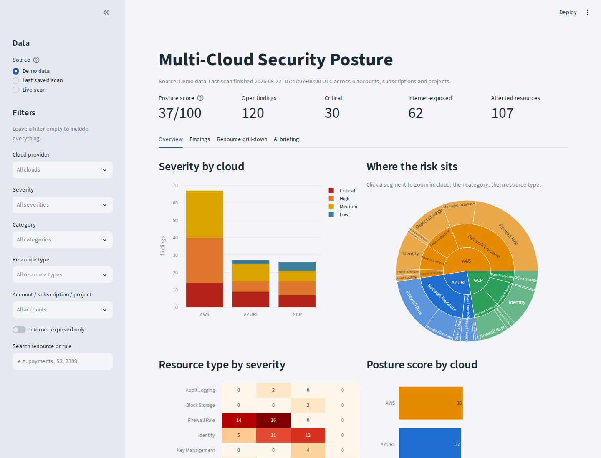
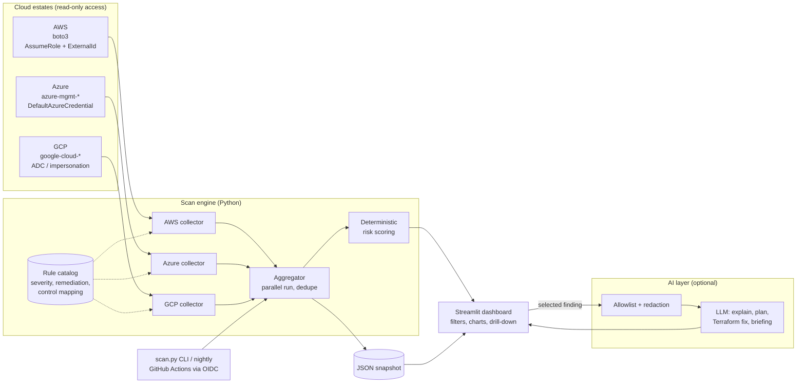

# Multi-Cloud Security Posture Dashboard

[](https://github.com/Aarpan-Sahu/multicloud-security-posture/actions/workflows/ci.yml)


One view of security risk across **AWS, Azure and GCP**, instead of three separate consoles.

The scanner uses each provider's native SDK with **read-only, keyless** credentials, normalizes every misconfiguration into one data model, scores it with a **deterministic, explainable** risk model, and presents it in a Streamlit dashboard with drill-down from cloud → category → resource type → resource. An optional **AI layer** turns a finding into an attack scenario, business impact and a Terraform fix, using **redacted data only**.



> Try it in 60 seconds with no cloud account: the dashboard ships with a realistic, seeded demo dataset.

---

## Contents
- [Architecture](#architecture)
- [Quick start (demo)](#quick-start-demo)
- [Scanning real accounts](#scanning-real-accounts)
- [What gets checked](#what-gets-checked)
- [Risk scoring](#risk-scoring)
- [AI safety design](#ai-safety-design)
- [Security of the tool itself](#security-of-the-tool-itself)
- [Project layout](#project-layout)
- [Testing and CI](#testing-and-ci)
- [Roadmap](#roadmap)
- [Contributing and security](#contributing-and-security)

## Architecture



**Key design choices**

| Decision | Why |
|---|---|
| One normalized `Finding` model for all clouds | Lets the UI, scoring and AI layer stay provider-agnostic. Adding a check is one catalog row plus one collector branch. |
| Severity lives in the rule catalog, not in collectors or the LLM | Prioritization is reproducible and auditable. The model can explain risk but can never downgrade or suppress it. |
| Stable `finding_id` = hash(provider, account, resource, rule) | Deduplicates across runs and enables trending and "how long has this been open". When one rule fails several times on a resource (say SSH and RDP in two rules of one security group), the evidence is merged into one finding. |
| Each API call is isolated | A missing permission on one service reduces coverage but never kills the scan. Gaps are shown in the UI as **Coverage gaps**, so silence is never mistaken for safety. |
| Collectors run concurrently | Three clouds scan in parallel; boto3 uses adaptive retries for throttling. |

## Quick start (demo)

```bash
git clone https://github.com/Aarpan-Sahu/multicloud-security-posture.git
cd multicloud-security-posture
python -m venv .venv && source .venv/bin/activate
pip install -r requirements.txt
streamlit run app.py
```

Open http://localhost:8501. **Demo data** is selected by default.

Or with Docker:

```bash
docker build -t mc-cspm .
docker run -p 8501:8501 mc-cspm
```

## Scanning real accounts

All access is read-only. Terraform for each cloud lives in [`terraform/`](terraform). No long-lived keys are created anywhere.

### 1. Provision scanner identities

<details>
<summary><b>AWS</b>: IAM role with SecurityAudit plus explicit data-plane deny</summary>

```bash
cd terraform/aws/scanner-role
terraform init
terraform apply \
  -var='trusted_principal_arns=["arn:aws:iam::<your-account>:user/<you>"]' \
  -var='external_id=<random-16+-chars>'
```
Then set `AWS_SCANNER_ROLE_ARN` and `AWS_SCANNER_EXTERNAL_ID` in `.env`.
The role also **denies** `s3:GetObject`, `secretsmanager:GetSecretValue`, `kms:Decrypt` and similar, so even a future over-broad attachment cannot read data.
</details>

<details>
<summary><b>Azure</b>: service principal with Reader + Security Reader</summary>

```bash
cd terraform/azure
terraform init
terraform apply -var='subscription_ids=["<sub-id>"]'
```
Locally, `az login` is enough (DefaultAzureCredential). In CI, set `github_subject` to create a federated credential; there is no client secret.
</details>

<details>
<summary><b>GCP</b>: service account with Viewer + Security Reviewer, used by impersonation</summary>

```bash
cd terraform/gcp
terraform init
terraform apply -var='host_project_id=<proj>' -var='scanned_project_ids=["<proj>"]' \
  -var='impersonators=["user:you@example.com"]'
gcloud auth application-default login \
  --impersonate-service-account=$(terraform output -raw service_account_email)
```
</details>

<details>
<summary><b>Optional lab</b>: intentionally misconfigured AWS resources to scan</summary>

`terraform/aws/lab` creates an unattached security group with SSH open and a private bucket with weak Block Public Access settings. No compute, no data, near-zero cost. Use a sandbox account and `terraform destroy` afterwards.
</details>

### 2. Configure and run

```bash
cp .env.example .env    # fill in regions, subscriptions, projects
set -a; source .env; set +a

# From the UI: choose "Live scan" in the sidebar, then Run scan
streamlit run app.py

# Or headless, e.g. from cron or CI. --fail-on makes it usable as a pipeline gate.
python scripts/scan.py --providers aws azure gcp --fail-on critical
```

Scans are saved to `data/findings.json` and can be reopened with **Last saved scan**.

### 3. Nightly keyless scans (optional)

[`.github/workflows/scheduled-scan.yml`](.github/workflows/scheduled-scan.yml) authenticates through **GitHub OIDC federation** to each cloud you have configured (a cloud without its repository variables is skipped) and uploads the snapshot as a build artifact. Nothing secret is stored in GitHub; only role ARNs, client IDs and provider names as repository variables.

## What gets checked

30 checks across identity, network exposure, data protection and logging. Full definitions, including remediation and control mapping, are in [`src/cspm/rules.py`](src/cspm/rules.py).

| Area | AWS | Azure | GCP |
|---|---|---|---|
| Public data | S3 public via policy, Block Public Access gaps (bucket and account level combined) | Storage public blob access | Buckets bound to `allUsers` / `allAuthenticatedUsers` |
| Network exposure | Security groups open to `0.0.0.0/0` or `::/0` on admin ports, database ports, or everything | NSG inbound Allow from `*` / `Internet` (port ranges and lists parsed), storage firewall default Allow | VPC firewall ingress from `0.0.0.0/0` or `::/0` |
| Databases | RDS public, RDS unencrypted | SQL firewall `0.0.0.0-255.255.255.255`, "Allow Azure services" | Cloud SQL authorized network `0.0.0.0/0` |
| Identity | Root keys, root MFA, console users without MFA, keys older than 90 days | | User-managed SA keys, SAs with owner/editor, public project IAM |
| Encryption and keys | EBS encryption by default | TLS below 1.2, HTTPS-only off, Key Vault purge protection | Uniform bucket-level access |
| Logging and detection | Multi-region CloudTrail, GuardDuty per region | | |

Compliance tags are indicative mappings to benchmark themes (CIS, NIST 800-53), not a certified audit.

## Risk scoring

```
risk(finding)  = severity_weight × exposure × age
                 severity_weight: Critical 40, High 20, Medium 8, Low 2
                 exposure:        1.5 if reachable from the internet, else 1.0
                 age:             1.0 → 1.5 over the first 30 days open

posture_score  = 100 × exp(−Σ risk / (800 × accounts_in_scope))
```

The score is normalized by the number of accounts, subscriptions and projects in view, so an estate with many accounts is not penalized just for being large. That count does not depend on the findings, so every new finding lowers the score and every fix raises it. The score degrades smoothly rather than hitting zero after a few findings. Severity, exposure and search filters narrow which findings count; the cloud and account filters also narrow the scope. The **Fix these first** table sorts by `risk`, so an internet-exposed High can outrank an internal one. The formula is in [`src/cspm/scoring.py`](src/cspm/scoring.py) and is unit-tested.

## AI safety design

The AI layer (`src/cspm/ai/`) is optional. Without `ANTHROPIC_API_KEY`, the app shows rule-catalog remediation and a deterministic summary, and everything else works the same.

| Risk | Control |
|---|---|
| Leaking customer identifiers to a third-party model | **Allowlist first**: only rule metadata and a fixed set of evidence keys are sent. Resource names, ARNs, subscription IDs and project IDs are never sent. **Redaction second**: surviving evidence is scrubbed of account IDs, GUIDs, ARNs, emails and IPs, with stable placeholders like `<ACCOUNT_1>`. The executive briefing sends aggregate counts only, and the UI shows the exact payload. |
| Prompt injection via attacker-controlled cloud metadata (tags, names, descriptions) | Such fields are not in the allowlist. Data is fenced in `<finding>` tags and the system prompt instructs the model never to follow instructions inside them. Tests assert that an injected string does not reach the payload. |
| The model changing what is "important" | Severity and ranking are computed before the model is called. The model only explains and proposes. |
| Malformed or hostile output | Strict JSON schema, length-clipped fields, fallback to the catalog on any parse failure. Streamlit renders markdown with HTML disabled. |
| Blindly applying generated fixes | Plans are labeled AI-generated, include a verification step and a downtime-risk note, and are proposals only. The tool has no write permissions anywhere. |
| Cost and latency | Responses are cached by content hash; nothing is sent until the user clicks. |

## Security of the tool itself

- **Least privilege, read-only** in every cloud, with an explicit AWS data-plane deny.
- **No static credentials**: AssumeRole with ExternalId (confused-deputy protection), Azure workload identity, GCP impersonation and Workload Identity Federation. No JSON keys, no client secrets.
- **Secrets never in code**: configuration comes from the environment; `.env`, state files and snapshots are git-ignored; CI runs **gitleaks**.
- **IaC scanned in CI** with Checkov (the intentionally vulnerable lab is excluded).
- **Container runs as non-root** with a health check.
- **Snapshots contain sensitive inventory**. Treat `data/findings.json` as confidential; it is git-ignored by default.

## Project layout

```
.
├── app.py                      # Streamlit dashboard
├── scripts/scan.py             # Headless scanner / CI gate
├── src/cspm/
│   ├── models.py               # Finding, Severity, ScanResult
│   ├── rules.py                # Rule catalog (single source of truth)
│   ├── netutils.py             # Port/CIDR exposure logic shared by all clouds
│   ├── scoring.py              # Deterministic risk + posture score
│   ├── aggregator.py           # Parallel scan, dedupe, snapshots
│   ├── config.py               # Env-based settings
│   ├── collectors/             # aws.py, azure.py, gcp.py, demo.py
│   └── ai/                     # redaction.py, advisor.py
├── terraform/
│   ├── aws/scanner-role/       # Read-only role, ExternalId, optional GitHub OIDC
│   ├── aws/lab/                # Optional intentionally misconfigured lab
│   ├── azure/                  # SP + Reader/Security Reader + federated credential
│   └── gcp/                    # SA + Viewer/Security Reviewer + WIF
├── tests/                      # Unit tests, incl. moto-backed AWS end-to-end
└── .github/workflows/          # CI and nightly OIDC scan
```

## Testing and CI

```bash
pip install -r requirements-dev.txt
ruff check .
pytest -q
```

- **AWS collector end-to-end** against an in-memory AWS (moto): creates open, safe and ICMP-only security groups, buckets with and without Block Public Access (including account-level coverage) and a console user without MFA, then asserts exactly the right findings appear.
- **Azure and GCP exposure logic** tested against NSG and firewall rule shapes, including port ranges, `Internet` service tags, disabled rules, ICMP-only rules, IPv6 `::/0` sources and IAP ranges.
- **AI safety**: redaction, placeholder stability, injection strings excluded, JSON-parse fallback, caching, offline mode.
- **UI smoke test**: the whole dashboard renders headlessly and filters change results.

CI runs lint and tests on Python 3.10 and 3.12, a demo scan, a Docker build with a health check, `terraform fmt` and `validate` for every module, Checkov and gitleaks.

## Roadmap

- Pull native findings from AWS Security Hub, Microsoft Defender for Cloud and GCP Security Command Center alongside custom checks.
- Trend view across snapshots (mean time to remediate, new vs resolved).
- Suppressions with owner, reason and expiry, stored as code.
- Org-wide discovery: AWS Organizations, Azure management groups, GCP folders.
- Ticket export (Jira / ServiceNow) and Slack alerts for new criticals.

## Contributing and security

Contributions are welcome; see [CONTRIBUTING.md](CONTRIBUTING.md). Dependabot keeps Python packages, GitHub Actions, the Docker base image and Terraform providers up to date. Please report vulnerabilities privately as described in [SECURITY.md](SECURITY.md).

---

*Built by **Aarpan Sahu** as a portfolio project. Released under the [MIT License](LICENSE). Run it only against accounts you are authorized to assess.*
